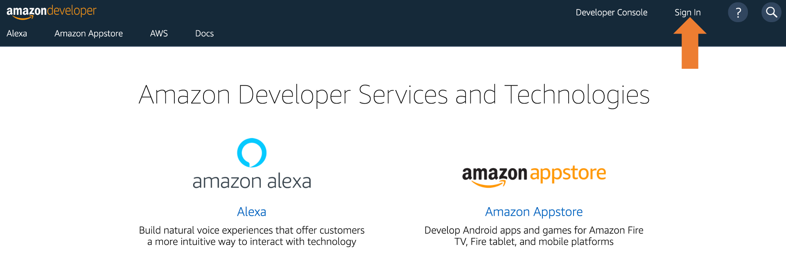
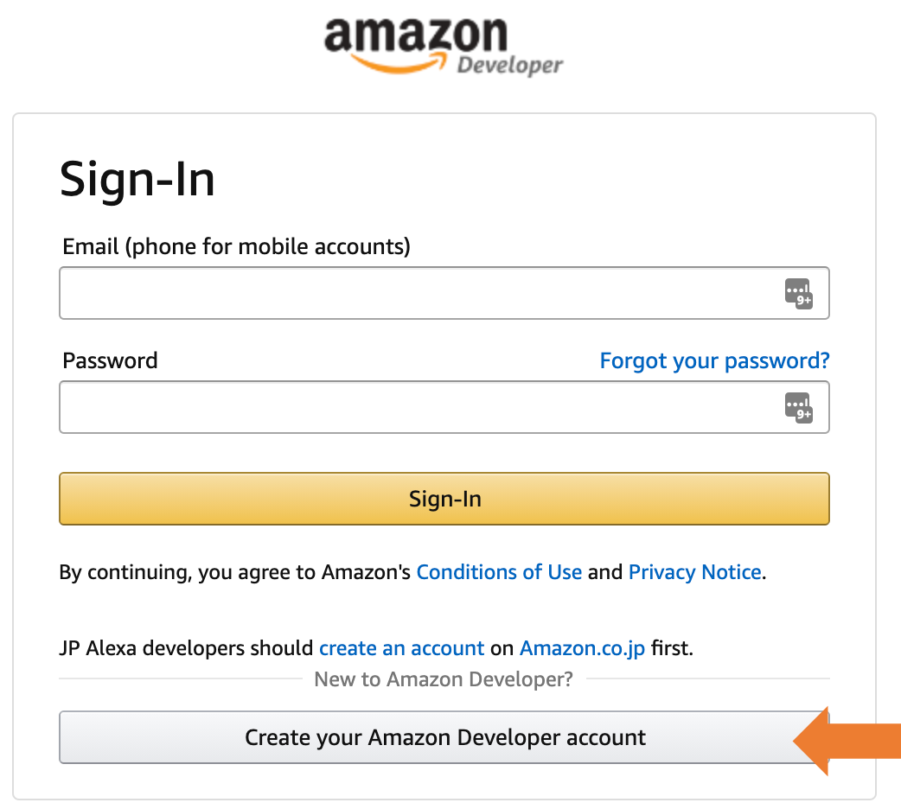
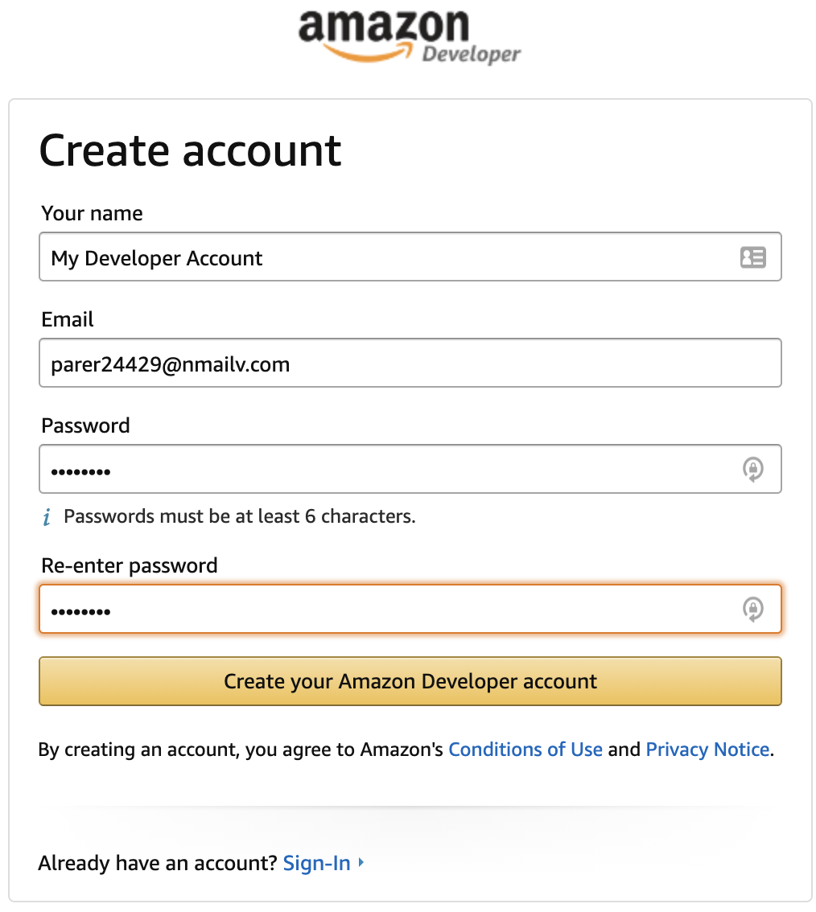
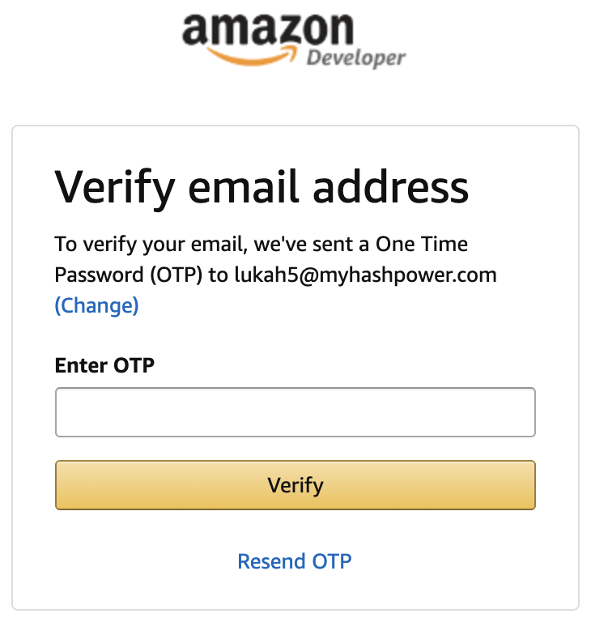
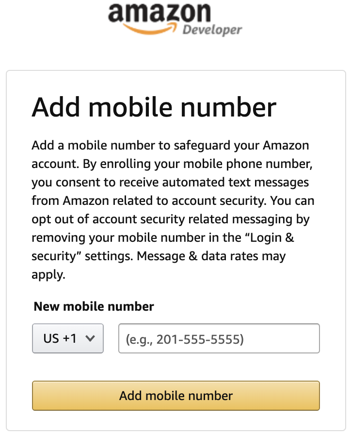

# Alexa Developer Account Setup

1. Go to https://developer.amazon.com/

2. Click on the Sign In link in the top right corner.

4. Click on the "Create your Amazon Developer Account."

5. Review the Amazon's Conditions of Use and Privacy Notice.

6. Fill in the details and click on the "Create your Amazon Devceloper account" button.

7. Verify your email account.

8. Register a mobile number and verify it.

9. Complete the account details.

10. Your Amazon Developer account is ready for use.

