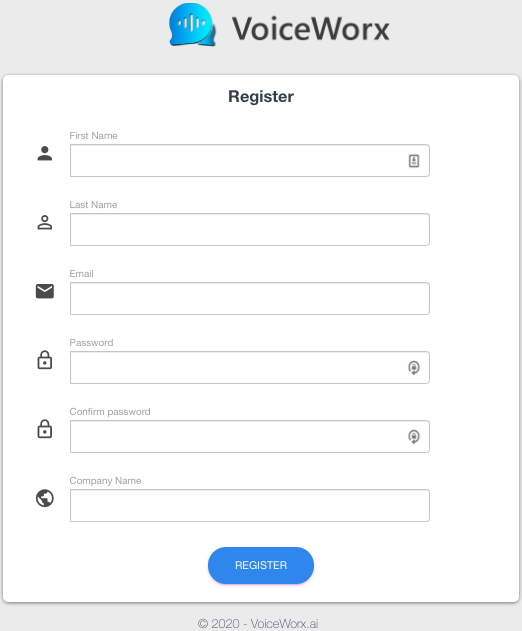
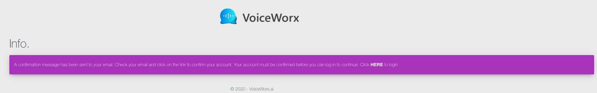
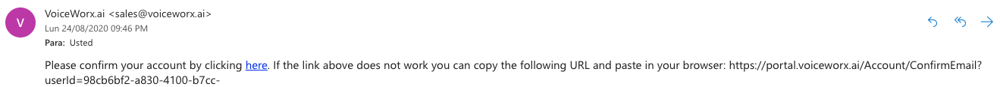
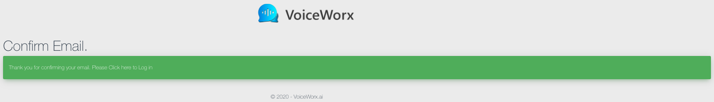
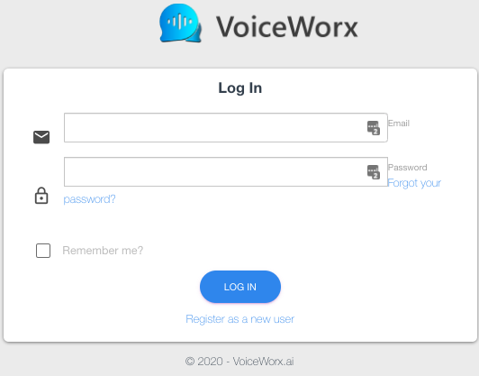
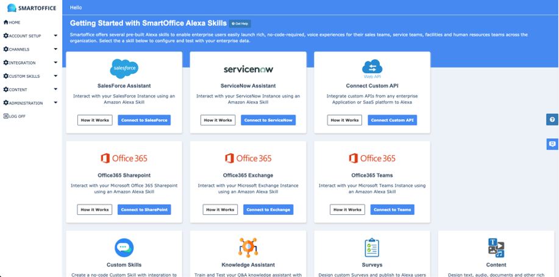

# Voiceworx account set up

1.	Go to https://portal.voiceworx.ai/Account/Register

2. Type the first name, the last name, the email, the password, the confirm password and the company name fields and then click the Register button at the bottom of the page. (This email address must be the same you used to create your Amazon Developer Account).

3. You will get an email address confirmation message. 

4.	After you confirm your email address, log in into your newly created account.

5. Complete the email and password fields, then click the Login button.

6. The Dashboard section is displayed on the screen after log in.

