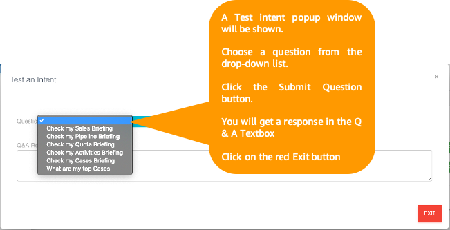

# Integrating Voiceworx.ai with Salesforce

1. Login to voiceworx portal: https://portal.voiceworx.ai

2. In the SalesForce Assistant section on the home page, click the Connect to SalesForce button.

3. Click the Submit button.

4. You will be redirected to the SalesForce login page.

5. Login with your Salesforce account.

6. Verify your identity.

7. Enter the verification code that was sent by email.

8. Your permission to connect SalesForce to SmartOffice will be requested. Click the Allow button to grant permission.

9. You will receive a confirmation that Smart Office was connected to the Salesforce CRM.

10.	In the Smart Office dashboard, go to Integration => Connect System.

11.	Click the Test button for SalesForce.

12.	A Test intent popup window will be shown. 

13.	Choose a question from the drop-down list. 

14.	Click the Submit Question button.

15.	Click the red Exit button.

