# Alexa for Business configuration

1. Log in to the AWS Alexa console.

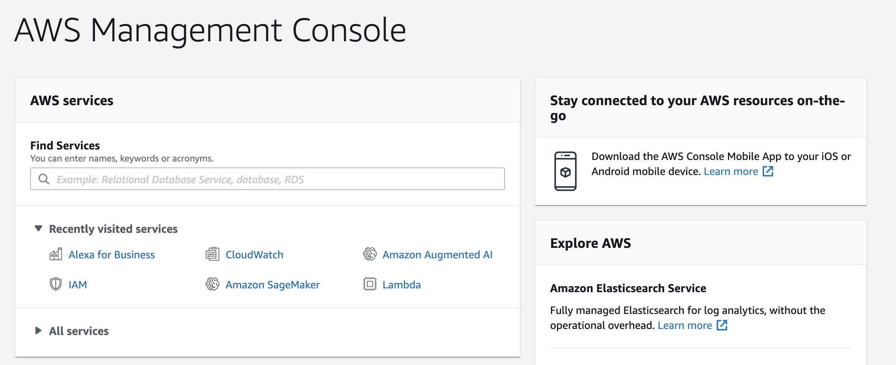

2. Go to the Alexa for Business console.

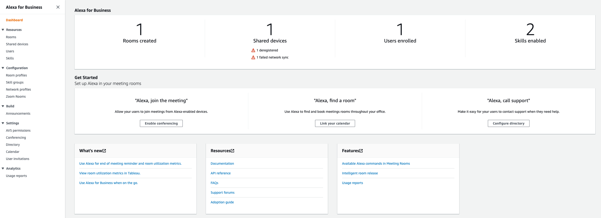

3. Go to the Resources > Skills > Alexa skills store.

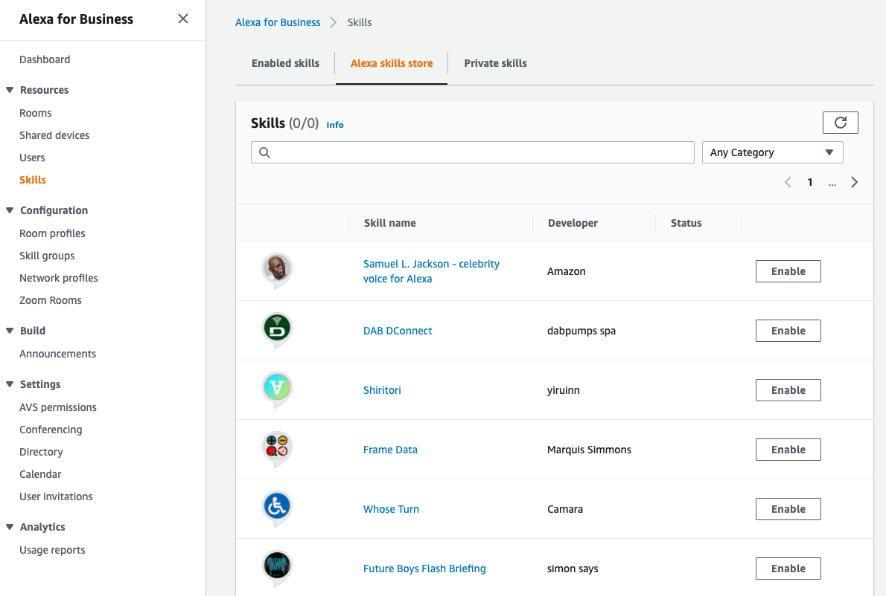

4. In the search texbox, type the word "voiceworx" and hit the Enter key.
5. You will see a skill with name "Sales Force", Developer Voiceworx.ai. Click on the "Enable" button.

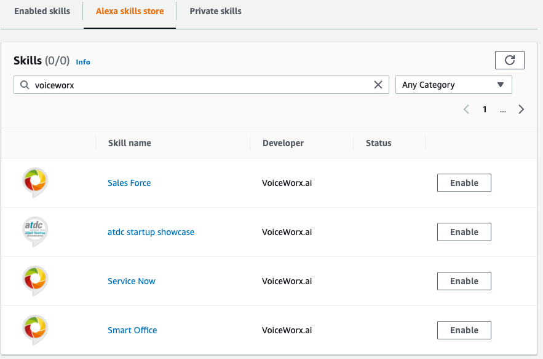

6. Confirm the account linking.

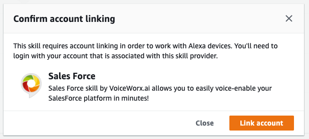

7. Enter the Alexa Developer account previously created

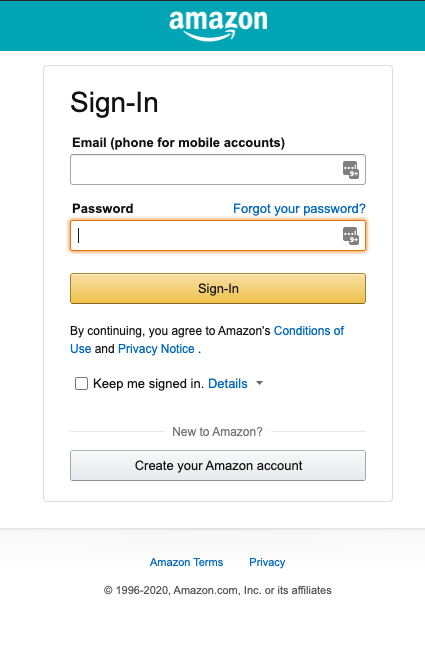

8. The skill is now enabled. We need to add it to a Skills group in A4B.

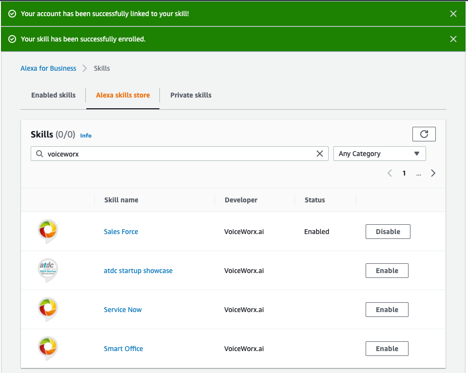

9. To do so, go to Configuration > Skill groups in the A4B Console.

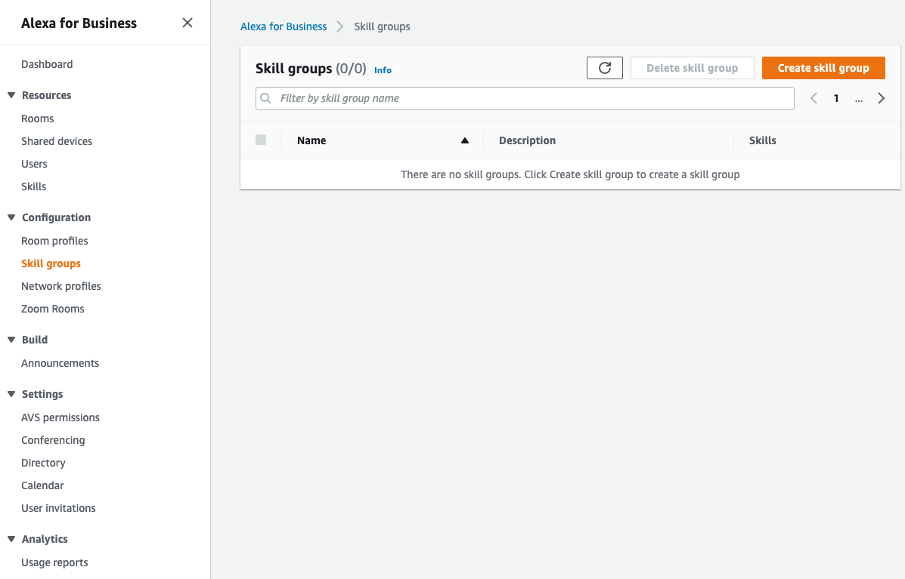

10. Click on the "Create skill group" button.

11. Once the skill group was created, click on the group name and then click on the "Add skills button."

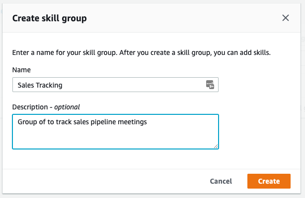

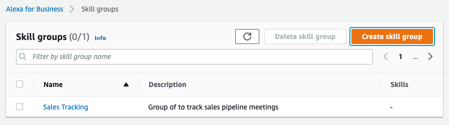

12. Click on the name of the group you created.

13. Click on the Add Skills Button

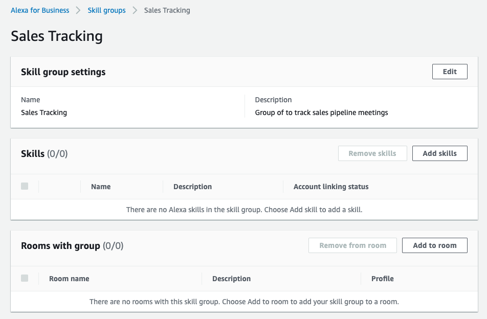

14. Select the voiceworx skill you previously added from the Alexa skill store and click on the Add button

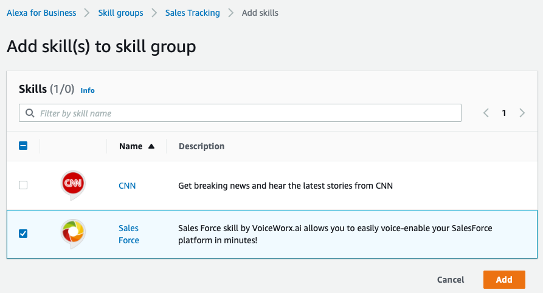

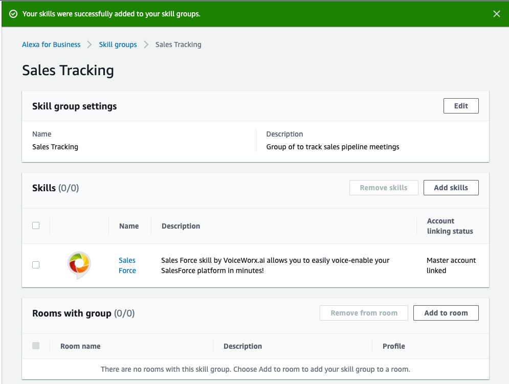

15. Click on the Add to room button

16. Select the room(s) where you want to add the Alexa skill group.

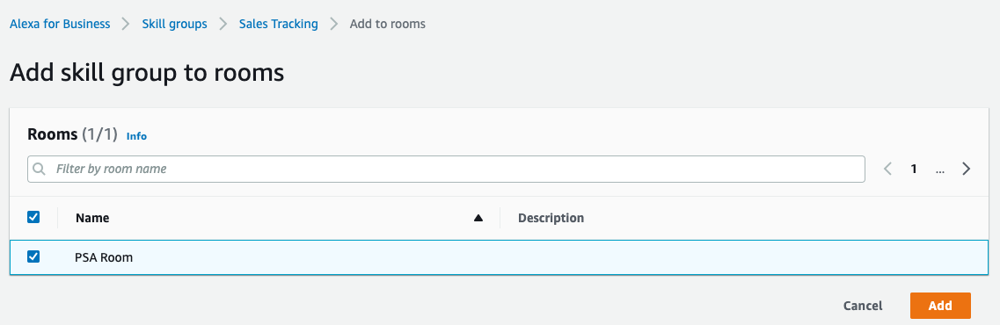

17. Select the Skills Group previously created and click on the "Add" button.

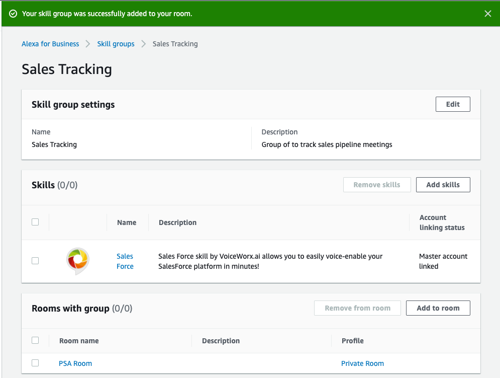

18. The Alexa skill will be available on the room you selected (including its shared devices)

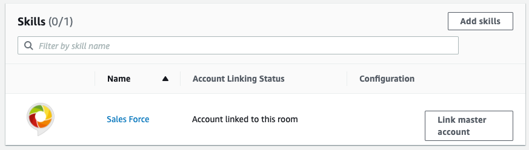

19. In on of the shared devices assigned to the room that we configured, invoke the Alexa skill saying "Alexa, open Salesforce". If you hear a welcome message the skill is configured correctly. After the welcome message, you can try the following phrases:

* "Check my sales briefing"
* "Check my pipeline briefing"
* "Check my quota briefing"
* "Check my activities briefing"
* "Check my cases briefing"
* To quit the skill, say "Stop" or "Cancel"
* To ask for assistance, say "Help"

